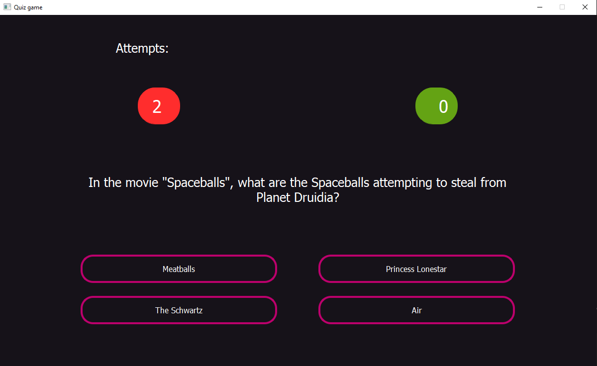

# Quiz game app - Python, PyQt5

Simple quiz game using questions from website [Open Trivia Database](https://opentdb.com).



## Installation
1. The first thing to do is to clone the repository:
    ```
    git clone https://github.com/matt064/quiz.git
    ```

2. Create a virtual environment to install dependencies in and activate it:
    ```
    python -m venv "path_to_catalog"'
    venv\Scripts\activate'
    ```

3. Then install the dependencies:
    ```
    (venv)pip install -r requirements
    ```

## Start app

```
py programmer.py
```


## Known issues
This project is till ongoing. The game still needs many improvements. This is coming soon.  